# Edu-AMR by ZenoRobotics
## Educational Autonomous Mobile Robot (AMR) Platform with SLAM & Autonomous Navigation
<br>

# **Details About Project**

## Software Used
- ROS - Noetic 
- Gazebo 
- Rviz 

## Robot 3D Model
<div align="center">
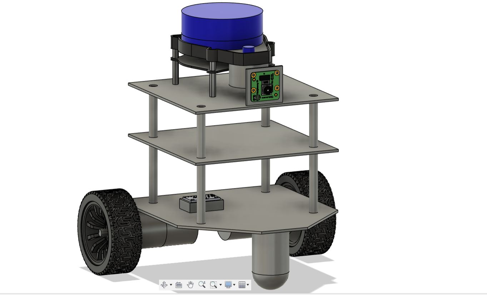
<br />
</div>

## Sensors Used
- 2D Lidar
- Raspberry Pi Camera V2.0
- 6-DOF IMU

## Clone this repository inside your ROS Workspace:
```
cd ~/catkin_ws/src/
git clone https://github.com/ZenoRobotics/Edu-AMR-Public.git
cd ~/catkin_ws/
catkin_make
source devel/setup.bash
```

## Launch the simulation and visualization
Type the command in a terminal to launch the Edu-AMR simulation:
```
roslaunch edu_amr_description gazebo.launch
```
<div align="center">
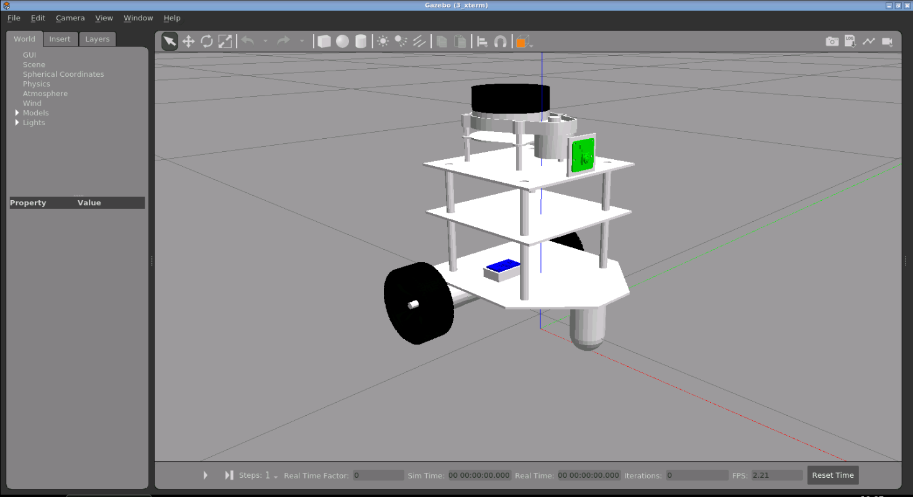</div><br />

Type the command in another terminal to run the Rviz visualization:
```
roslaunch edu_amr_description rviz.launch
```
<div align="center">
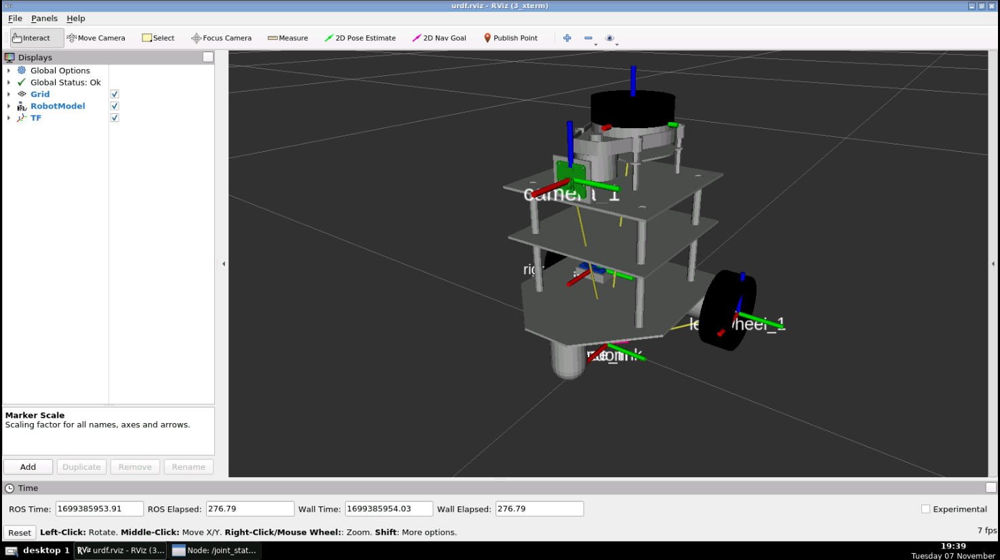</div>


## Launch SLAM - Gmapping
Type the command in a terminal to launch the Robot Navigation world simulation:
```
roslaunch edu_amr_description navigation_sim.launch
```
<div align="center">
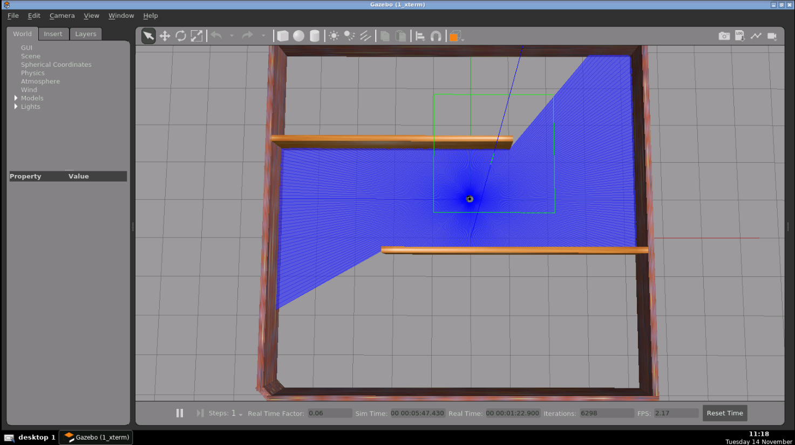</div><br />

Type the command in another terminal to run the Gmapping SLAM node:
```
roslaunch edu_amr_navigation gmapping_slam.launch
```
<div align="center">
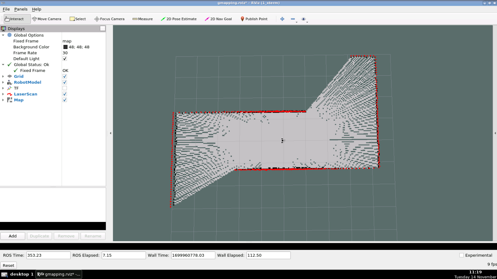</div>

Type the command in another terminal to run teleoperation node and move the robot around the area to create the map:
```
rosrun teleop_twist_keyboard teleop_twist_keyboard.py
```

When the map is created successfully, open a new terminal and type the command to save the map:
```
rosrun map_server map_saver -f ~/map
```
<div align="center">
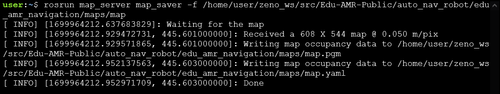</div>
<div align="center">
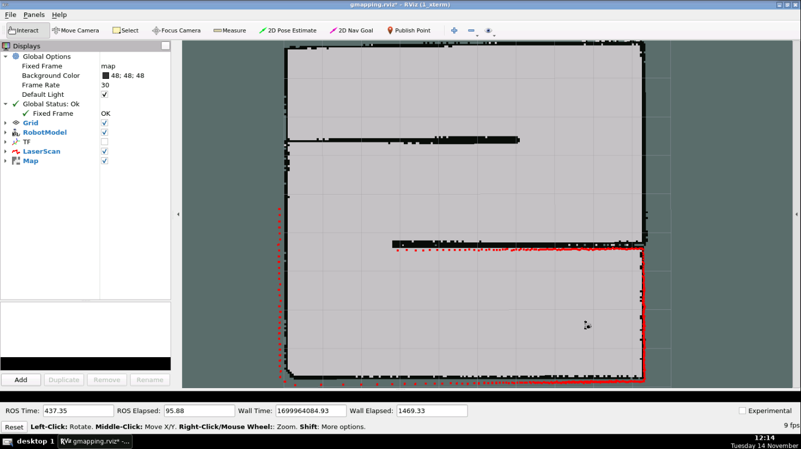</div>

## Run Autonomous Navigation
Type the command in a terminal to launch the Robot Navigation world simulation:
```
roslaunch edu_amr_navigation navigation_sim.launch
```
<div align="center">
</div><br />

Type the command in another terminal to run the Navigation node:
```
roslaunch edu_amr_navigation navigation.launch
```
<div align="center">
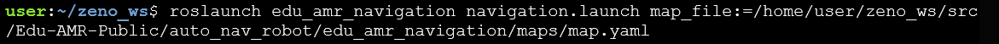</div>

<div align="center">
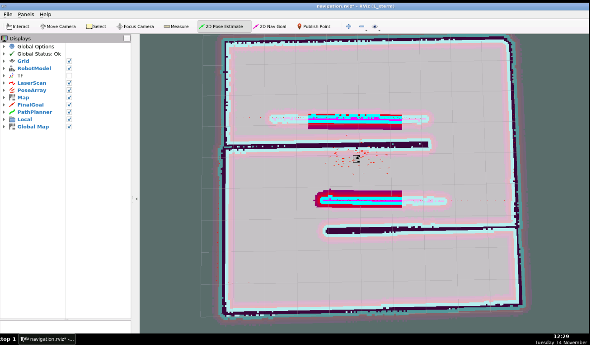</div>

### Estimate Initial Pose
Initial Pose Estimation must be performed before running the Navigation as this process initializes the AMCL parameters that are critical in Navigation. 
1. Click the 2D Pose Estimate button in the RViz menu.

<div align="center">
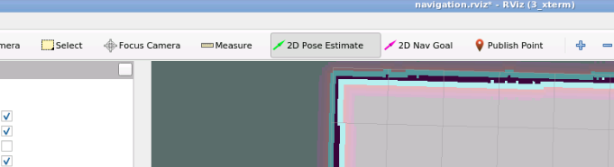</div>

2. Click on the map where the actual robot is located and drag the large green arrow toward the direction where the robot is facing.
<div align="center">
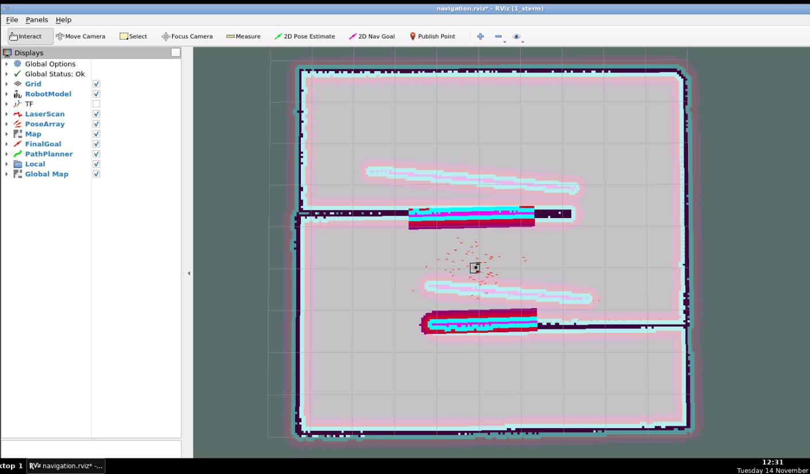</div>

### Set Navigation Goal
1. Click the 2D Nav Goal button in the RViz menu. 

<div align="center">
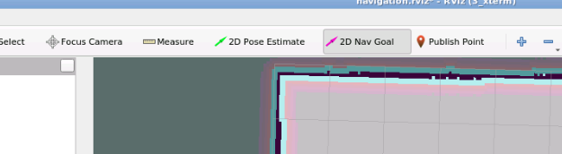</div>

2. Click on the map to set the destination of the robot and drag the green arrow toward the direction where the robot will be facing. 

<div align="center">
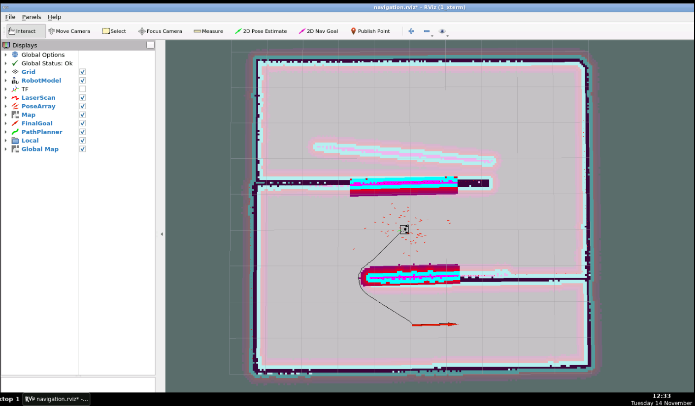</div>

## Output - Autonomus Navigation
<div align="center">
</div>

